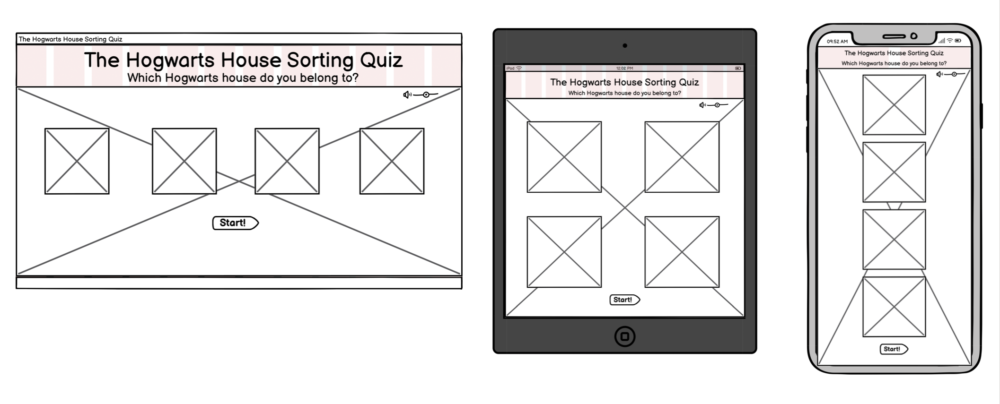
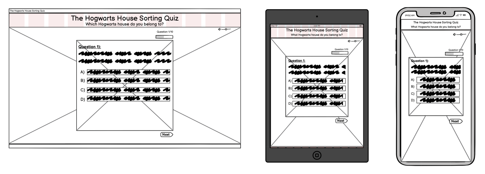
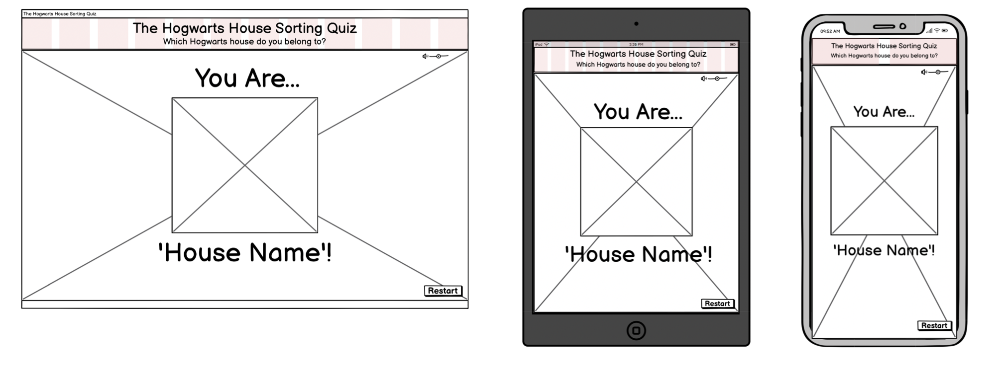

# The Hogwarts House Sorting Quiz
The Hogwarts House Sorting Quiz is a quiz that determines the Hogwarts house the site user sorts into depending upon the choices they select for each question. Specifically, it is designed with 'Potterheads' in mind to provide a morsel of the experiences in the wizarding world for us 'muggles'. 

<!-- Add Am I Responsive? completed site image here -->

<!-- Add GitHub Pages link once deployed -->
---

## CONTENTS

* [User Experience](#user-experience-ux)
  * [User Stories](#user-stories)

* [Design](#design)
  * [Colour Scheme](#colour-scheme)
  * [Typography](#typography)
  * [Imagery](#imagery)
  * [Wireframes](#wireframes)

* [Features](#features)
  * [General Features on Each Page](#general-features-on-each-page)
  * [Future Implementations](#future-implementations)
  * [Accessibility](#accessibility)

* [Technologies Used](#technologies-used)
  * [Languages Used](#languages-used)
  * [Frameworks, Libraries & Programs Used](#frameworks-libraries--programs-used)

* [Deployment & Local Development](#deployment--local-development)
  * [Deployment](#deployment)
  * [Local Development](#local-development)
    * [How to Fork](#how-to-fork)
    * [How to Clone](#how-to-clone)

* [Testing](#testing)

* [Credits](#credits)
  * [Code Used](#code-used)
  * [Content](#content)
  * [Media](#media)
  * [Acknowledgments](#acknowledgments)

---

## User Experience (UX)

### User Stories

- #### First Time Visitors
    - As a First Time Visitor, I want to be able to identify the purpose of the quiz. 
    - As a First Time Visitor, I want to understand how to participate in the quiz.
    - As a First Time Visitor, I want to be able to navigate through the questions with ease. 
    - As a First Time Visitor, I want to be able to understand what it is that the question is asking with complete clarity. 

- #### Returning Visitors
    - As a Returning Visitor, I want to be able to access and begin the quiz swiftly and with ease. 
    - As a Returning Visitor, I want to have a complete understanding of the questions & complete them quickly and effectively. 

- #### Frequent Visitors
    - As a Frequent Visitor, I want to be able to carry out the quiz numerous times confidently. 

## Design

👩🏻‍💻 View an example of a completed design section [here](https://github.com/kera-cudmore/earth-day-hackathon-2022#Design)

### Colour Scheme

Add all information about your colour scheme for your site here. You can explain why you choose the colours you did?

I like to include a palette of the colour scheme here, my favourite site for creating a colour palette is [coolors](https://coolors.co/), but there are lots of other sites that also do the same thing, like [ColorSpace](https://mycolor.space/?hex=%23F5F5F5&sub=1), [Muzli Colors](https://colors.muz.li/), [Adobe Colour Wheel](https://color.adobe.com/create/color-wheel) and [Canva](https://www.canva.com/colors/color-palette-generator/) to name a few.

### Typography

If you've imported fonts to use in your project, add some information about them here. You can include information like:

Why did you choose the font you have?
Is this an accessibly friendly font?
What weights have you included?

I also like to include an image of the fonts chosen as a reference.

[Google Fonts](https://fonts.google.com/) is a popular choice for importing fonts to use in your project, as it doesn't require you to download the fonts to use them.

### Imagery

Use this section to explain what sort of imagery you plan to use through your site.

### Wireframes

- ### Main Page Wireframes

    

- ### Quiz Page Wireframes

    

- ### Results Page Wireframes

    

## Features

👩🏻‍💻 View an example of a completed user experience section [here](https://github.com/kera-cudmore/TheQuizArms#Features)

This section can be used to explain what pages your site is made up of.

### General features on each page

If there is a feature that appears on all pages of your site, include it here. Examples of what to include would the the navigation, a footer and a favicon.

I then like to add a screenshot of each page of the site here, i use [amiresponsive](https://ui.dev/amiresponsive) which allows me to grab an image of the site as it would be displayed on mobile, tablet and desktop, this helps to show the responsiveness of the site.

### Future Implementations

What features would you like to implement in the future on your site? Would you like to add more pages, or create login functionality? Add these plans here.

### Accessibility

Be an amazing developer and get used to thinking about accessibility in all of your projects!

This is the place to make a note of anything you have done with accessibility in mind. Some examples include:

Have you used icons and added aria-labels to enable screen readers to understand these?
Have you ensured your site meets the minimum contrast requirements?
Have you chosen fonts that are dyslexia/accessible friendly?

Code Institute have an amazing channel for all things accessibility (a11y-accessibility) I would highly recommend joining this channel as it contains a wealth of information about accessibility and what we can do as developers to be more inclusive.

## Technologies Used

### Languages Used
- HTML
- CSS
- JavaScript

### Frameworks, Libraries & Programs Used
- [Balsamiq:](https://balsamiq.com/) was used to develop the wireframes during the design process. 
- [GitHub:](https://github.com/) created the repository in which the project's code is pushed to from Git. 
- [Git:](https://git-scm.com/) was used within the GitPod Terminal in order to add, commit & push to GitHub. 

Add any frameworks, libraries or programs used while creating your project.

Make sure to include things like git, GitHub, the program used to make your wireframes, any programs used to compress your images, did you use a CSS framework like Bootstrap? If so add it here (add the version used).

A great tip for this section is to include them as you use them, that way you won't forget what you ended up using when you get to the end of your project.

## Deployment & Local Development

👩🏻‍💻 View an example of a completed Deployment & Local Development section [here](https://github.com/kera-cudmore/TheQuizArms#Deployment)

### Deployment

Include instructions here on how to deploy your project. For your first project you will most likely be using GitHub Pages.

### Local Development

The local development section gives instructions on how someone else could make a copy of your project to play with on their local machine. This section will get more complex in the later projects, and can be a great reference to yourself if you forget how to do this.

#### How to Fork

Place instructions on how to fork your project here.

#### How to Clone

Place instructions on how to clone your project here.

## Testing

Start as you mean to go on - and get used to writing a TESTING.md file from the very first project!

Testing requirements aren't massive for your first project, however if you start using a TESTING.md file from your first project you will thank yourself later when completing your later projects, which will contain much more information.
  
Use this part of the README to link to your TESTING.md file - you can view the example TESTING.md file [here](milestone1-testing.md)

## Credits

👩🏻‍💻 View an example of a completed Credits section [here](https://github.com/kera-cudmore/BookWorm#Credits)

The Credits section is where you can credit all the people and sources you used throughout your project.

### Code Used
- [GreatStack:](https://www.youtube.com/watch?v=PBcqGxrr9g8&t=27s)

[W3Schools](https://www.w3schools.com/)  was used to include the following code:
-  [Favicon](https://www.w3schools.com/howto/howto_html_favicon.asp)
-  [Alignment of images](https://www.w3schools.com/howto/howto_css_images_side_by_side.asp)
-  [Center alignment of button](https://www.w3schools.com/howto/tryit.asp?filename=tryhow_css_center-flex_btn)
-  [Shadow buttons](https://www.w3schools.com/css/css3_buttons.asp)
    

If you have used some code in your project that you didn't write, this is the place to make note of it. Credit the author of the code and if possible a link to where you found the code. You could also add in a brief description of what the code does, or what you are using it for here.

### Content

- The structure and sections of content are taken from the README.md exemplar file developed by [Kera Cudmore](https://github.com/kera-cudmore/readme-examples/blob/main/milestone1-readme.md).

Who wrote the content for the website? Was it yourself - or have you made the site for someone and they specified what the site was to say? This is the best place to put this information.

###  Media
[PNGEgg](https://www.pngegg.com/) was used to source the following images:

 - [Harry Potter Logo](https://www.pngegg.com/en/png-kdysu)
 - [Sorting Hat Favicon](https://www.pngegg.com/en/png-cwcjr#google_vignette)
 - [Gryffindor Crest](https://www.pngegg.com/en/png-nqglz)
 - [Slytherin Crest](https://www.pngegg.com/en/png-nerxh)
 - [Ravenclaw Crest](https://www.pngegg.com/en/png-owiqf)
 - [Hufflepuff Crest](https://www.pngegg.com/en/png-bttpu)

[Conde Nast Traveler:](https://www.cntraveler.com/activities/orlando/the-wizarding-world-of-harry-potter-diagon-alley) This site was used to download the background image of Diagon Alley. 
  
###  Acknowledgments

I would like to acknowledge the following people:
- Alan (CI Tutor Support) : A massive thank you for taking the time to resolve the cropping of an image canvas to ensure all the images are of equal size. 

